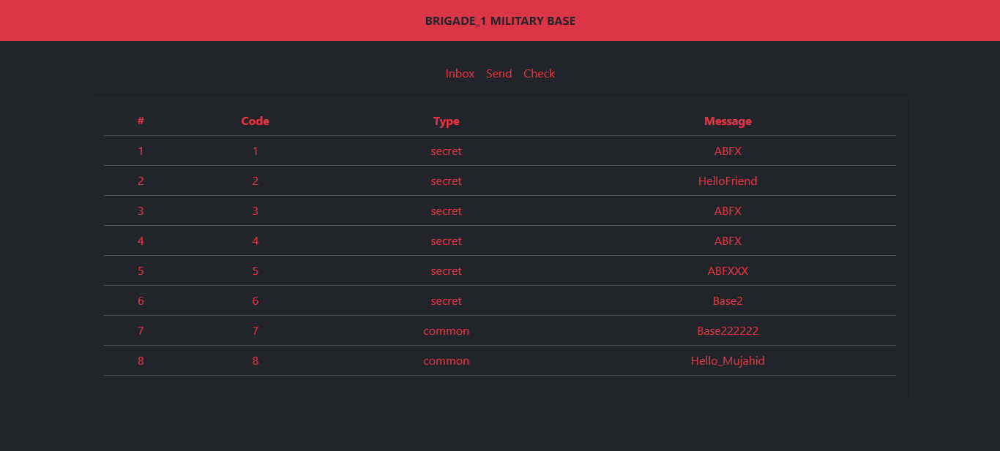
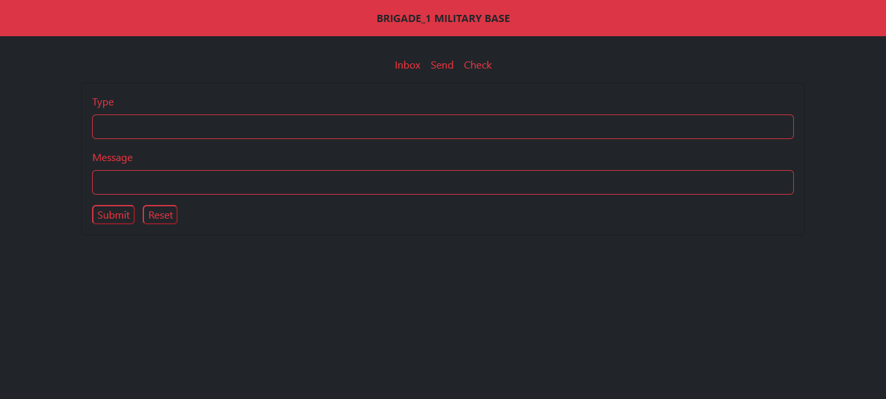
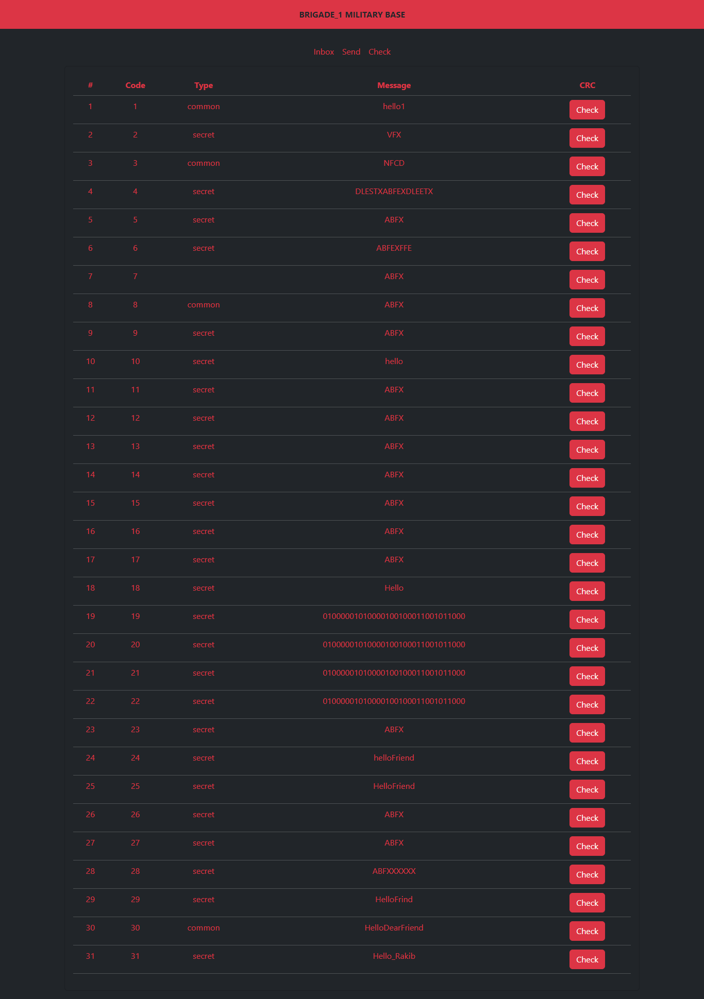
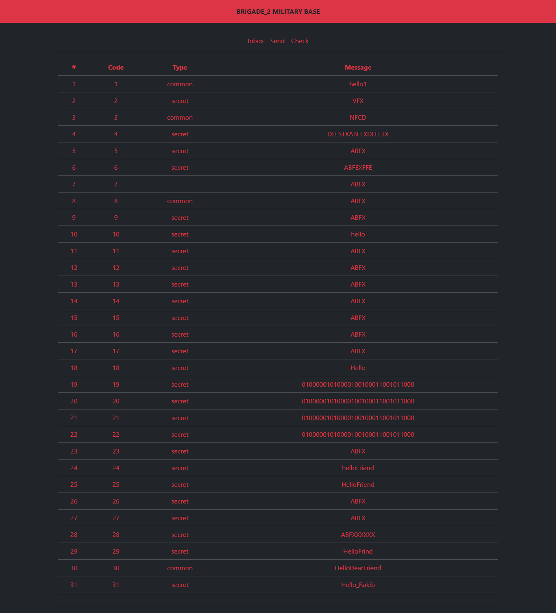
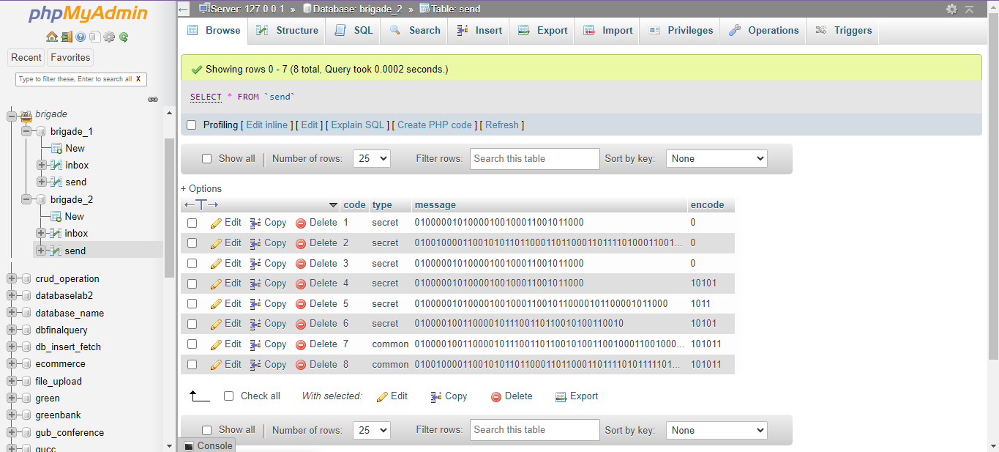

# Military Communication Website

This is a website build using HTML & Bootstrap in Frontend. In my backend I've used PHP & MySQL. This website make for academic project in my Data Communication Lab. In this project I've implemented Double Layer Encryption of Data which is shown below in the database section and the pages like brigrade_1 & brigrade_2 is different database inter-connected. When we send data from brigrade_1 it will sent to brigrade_2 database inbox, another one is vice-versa.

## Login Page

## Brigrade 1 Inbox

## Brigrade 1 Send Box

## Brigrade 1 CRC Check Box

## Brigrade 2 Inbox

## Two Layer Data Encryption

